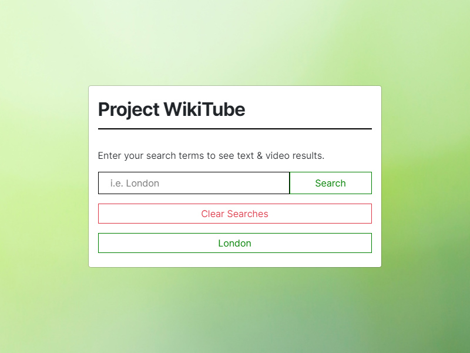
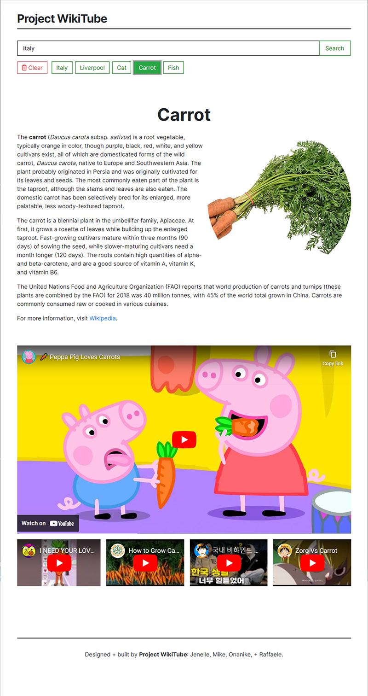

# Project WikiTube

## Our Task

Work in a group of 4 to design and build a web app using two public APIs. Use the`Bootstap` framework together with `JavaScript`, `HTML`, `CSS`, and `Font Awesome`.

## User Story

```
AS A user of Project WikiTube 
I WANT to search for a topic in both text and video formats
SO THAT I can see content from two seperate sources
SO THAT I can see an image representing my search terms
SO THAT I can read an overview of text information about my search
SO THAT I can see popular videos on my search terms
I WANT to search for recent videos on my search terms
AS A user I should be to see my recent searches
SO THAT I can re-run them
AS A user I should be able to enter a brand new search
```

### Acceptance Criteria

* Use Bootstrap

* Be deployed to GitHub Pages

* Is Interactive

* Use at least two server-side APIs

* Does not use alerts, confirms, or prompts

* Has at least one modal

* Use client-side storage to store persistent data

* Be responsive

* Have a polished UI

* Have a clean repository that meets quality coding standards

    - file structure
    
    - naming conventions

    - best practices for class/id naming conventions

    - indentation

    - quality comments

* Have a quality README (including a unique name, description, technologies used, screenshot, and link to the deployed application)

### Technologies Used

* HTML, CSS, JavaScript, jQuery, Google Fonts, Wikipedia API, YouTube API, Git.

### Software Used

* GitHub, Trello, Figma, Google Slides, Adobe Express.

### Deployed Application 

View and explore our deployed [application](https://rafdimartino.github.io/project-wikitube/).

### Presentation

As part of our project we have written a [presentation](https://express.adobe.com/page/hHOteMelPSmXs/).

### Installation    

N/A

### Screenshot




### Credits

* Jenelle Spio-Garbrah. ([GitHub](https://github.com/jenieb3))

* Michael Frank Samaras. ([GitHub](https://github.com/makemassair))

* Obinna Onanike. ([GitHub](https://github.com/onanapower))

* Raffaele Di Martino ([GitHub](https://github.com/RafDiMartino))

### License

MIT License
